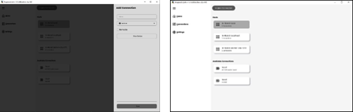
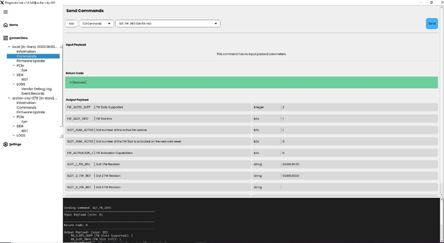
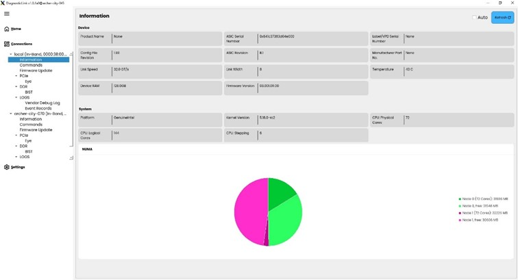
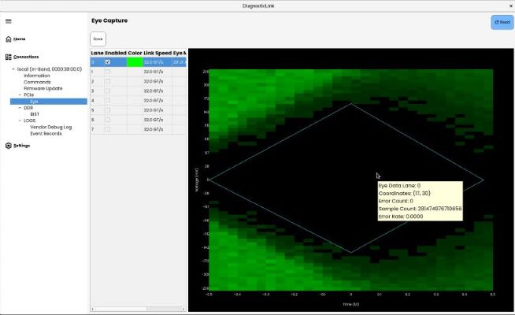

# DiagnosticLink

DiagnosticLink is a desktop application that enables debugging and managing CXL
modules using a convenient graphical interface.

Managing and debugging Compute Express Link (CXL) modules has become crucial to
ensuring optimal performance and reliability in the rapidly evolving computing
landscape. Addressing this need, we are excited to announce the launch of a
cutting-edge GUI application designed to streamline the enabling and debugging
of CXL modules. We developed this tool to revolutionize how developers and
engineers interact with CXL controllers and firmware, providing a comprehensive
suite of features to enhance productivity and efficiency.

## Features

**Local and Remote Operation**

Users can operate the application locally on a server or their laptop. For
remote operations, the application seamlessly connects to a server, offering
flexibility and convenience.



**Connection Management**

Users can establish new connections by selecting from various transport methods,
including in-band (side-band, and UART planned). Each connection is uniquely
identified by a combination of server and device, allowing users to manage
multiple connections simultaneously.


**Command Execution**

The application supports sending any CXL specification-defined and
vendor-specific (VS) commands, providing comprehensive control over device
operations.



**System and Device Information**

Users can access detailed information about the system and connected devices.
The application also features a graphical representation of the status of all
NUMA nodes, offering a clear and intuitive overview and demonstrating our
innovation in presenting data in a user-friendly manner.



**PCIe Eye Status Analysis**

The tool lets users capture and analyze PCIe eye status, facilitating in-depth
diagnostics and performance tuning.



**Firmware Updates and Log Capture**

The application allows for seamless firmware updates and real-time log capture,
including vendor debug logs and event records, ensuring that users can access
critical information for troubleshooting and optimization.

## Supported CXL Modules

- CZ120: https://www.micron.com/products/memory/cxl-memory
- CZ122: https://www.micron.com/about/blog/applications/data-center/introducing-micron-cz122-and-red-hat-certification-of-memory-expansion-portfolio

## Getting Started

DiagnosticLink is a self-contained exe that attempts to minimize the steps
required to get up and running. However, there are some system dependencies
required:

### Linux Prerequisites

A linux desktop is required to run the GUI. Only a terminal is required to run the server
libEGL / libEGL-mesa

### Ubuntu for GUI

```apt install libgles2-mesa-dev libxkbcommon-x11-0 libxcb-cursor0 libxcb-randr0 libxcb-icccm4 libxcb-image0 libxcb-keysyms1 libxcb-render-util0 libxcb-xkb-dev```

### Windows Prerequisites

As of now there are no known prerequisites for Windows. The exe should be entirely self-contained.

## Running Locally on Linux

Linux is the only OS that currently supports In-Band hardware access. Just
execute the binary to run in GUI mode:

`sudo ./DiagnosticLink`

## Running Remotely on Linux or Windows

You can run a DL server on linux with administrator privileges like this:
If you want to run a server only you can do:

`sudo ./DiagnosticLink --server [--port NNNN]`

This will open a TCP port on the host system that you can connect to
from the UI running on a client system.

Then run the client on linux like this:

`sudo ./DiagnosticLink`

Or on windows just double-click the exe to run the client.

You can then use the GUI to create a connection to a remote linux host with a
DiagnosticLink server.

## Changelog

- 2024.11.26.dev1: Initial release, support for CZ120, CZ122

